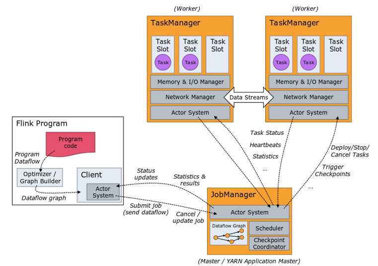

### Flink架构
1、Client 作业客户端
2、JobManager 作业管理器
3、TaskManager 任务管理器

***JobManager***
1、客户端(Client)将任务提交给JobManager,JobManager再将任务调度给TaskManager进行执行。然后TaskManager将任务状态、统计信息返回给JobManager.
2、JobManager会每隔一定时间向TaskManager发送请求，TaskManager则返回Hearbeats来证明自己存活。

***TaskManager*** 
1、任务的执行者。