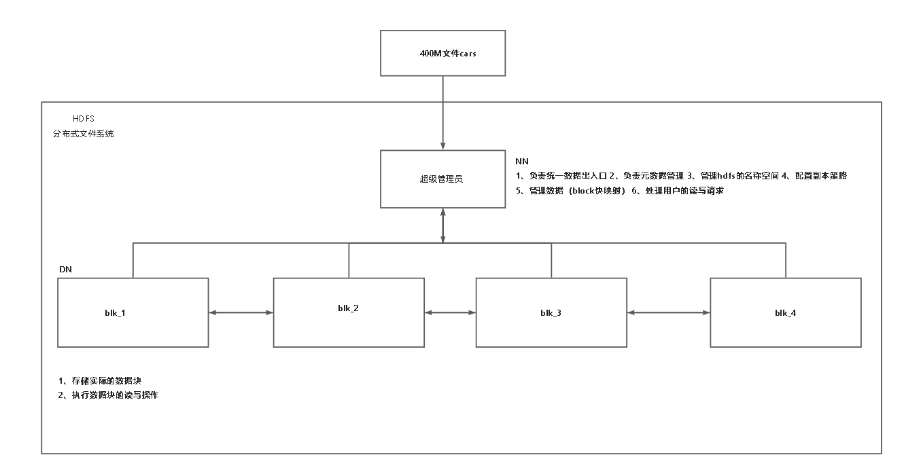
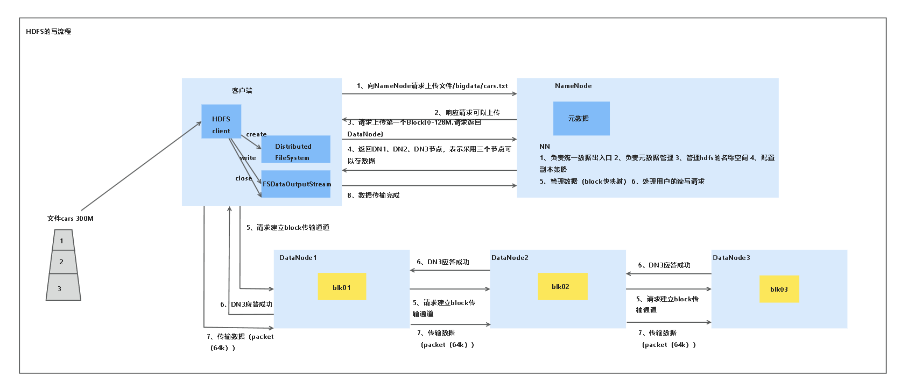
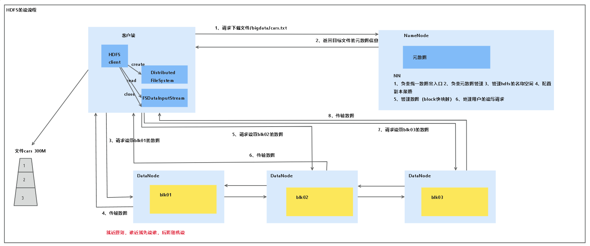

## 一、HDFS文件系统
### 1、节点
HDFS为分布式文件系统

其中主节点为namenode 负责管理文件系统

具体包括:
***负责统一数据出入口***
(用户不管是上传还是下载数据都需要向namenode提交申请)
***负责元数据管理***
(用户需要向主节点申请访问数据,主节点(namenode)会返回数据存放的元数据(其中包含了数据的路径))
***管理hdfs的命名空间***
(所有的主节点都会管理命名空间,而namenode是hdfs的,所以管理hdfs的命名空间)
***配置副本策略***

***管理数据(block 映射)***
(数据以block(默认128MB)的形式存放在datanode中)

***处理数据的读写请求***

从节点为datanode 负责存储数据

***存储实际的数据***

***执行用户的读写请求***

另一个节点为secondary namenode

***辅助namenode,冷读写***

### 2、架构

用户先和namenode申请进行读/写操作,然后namenode将可以存放/读写的元数据返回给用户，让用户去查找数据。

### 3、读写流程
***HDFS写流程***:
文件首先传输到HDFS client,然后HDFS client创建一个Distributed FileSystem和FSDataOutputStream(文件读写流)。
在客户端完成这些后,客户端会向Namenode申请上传文件,namenode会应答客户端的请求，返回可以上传文件。(namenode第一次应答)
客户端在接受到可以上传的请求后，客户端会请求上传文件的一个block，并申请namenode返回可以接受block块的datanode。namenode应答客户端的请求并返回客户端可以接受block块的datanode。(namenode第二次应答)
客户端在收到namenode返回的datanode后，请求datanode创建传输通道来传输文件的block块。datanode依次应答请求客户端的请求并且建立传输通道。
客户端在得到datanode应答、创建传输通道成功后,通过传输通道上传文件的block块到datanode上。
上传完一个block后，客户端会像namenode发送上传完成的信息，然后重复流程直至文件的所有block块全部上传完成。

***HDFS的读流程***
客户端在读数据时会在内部创建FSDataInputStream和FileSystem.创建完成后，
客户端向namenode提交申请,请求下载文件，namenode应答客户端的申请,并且返回数据block块所在的元数据。(namenode第一次应答)
在得到元数据后客户端会向数据第一个block块所在的datanode读取数据,然后依次读取剩下的block，直到文件的block块全部读完。然后客户端将所有的block块拼成文件返回给用户，并且关闭FSDatainputStream.

