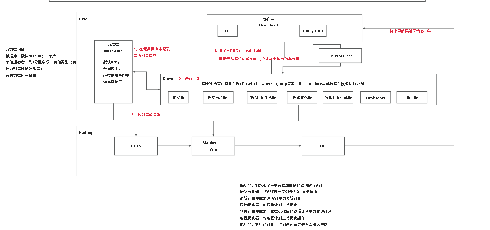

### hive 架构
客户端将用户编写的代码传入driver端，driver端对代码进行分析,
如果是创建删除表类，在执行完毕后会将新的元数据写入到元数据库中，并且将元数据映射到HDFS的表中。
如果是其他类的语句(比如统计计算类),***driver端就会对其进行解析，语义分析,然后生成逻辑计划,优化逻辑计划,根据逻辑计划生成物理计划,优化物理计划,在将其在mapreduce中执行***,并将执行结果根据是否要储存在hdfs，储存在hdfs中，然后将结果返回给用户.

***元数据库:*** 其中元数据库默认在deby中,但是一般推荐将其设置在mysql中。元数据中保存了表的位置等相关信息。

***解析器*** 将sql语句转换成语法树(AST)

***语义分析器*** 将AST进一步分为QueryBlock

