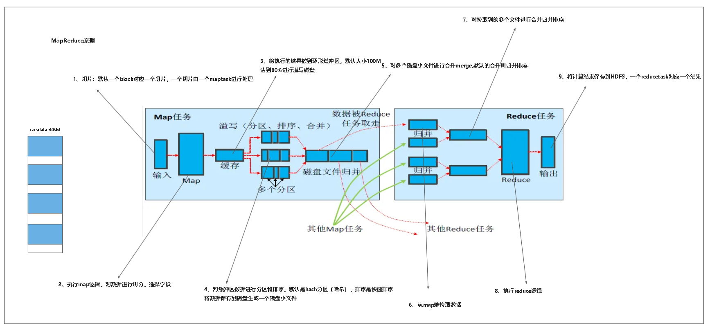

mapreduce 分为 map阶段和reduce阶段,在map(阶段)和reduce(阶段)会有一个shuffle阶段。

在map阶段,map端会将任务切成一个一个block块，(每个block对应着一个maptask),分别对block块执行map逻辑,执行后,将数据写入到环形缓冲区(一般为100M，数据达到80%的时候会将数据溢写到磁盘上),并对缓冲区的数据进行分区(哈希分区)、排序(快速排序)、保存成一个一个小文件，最后map对这些小文件进行归并排序，产出为map阶段的结果。

reduce通过shuffle拉取所有map阶段的结果,并对拉取来的数据再次进行一次归并排序，执行reduce逻辑,将结果保存到hdfs上，一个reduce对应一个reducetask。
