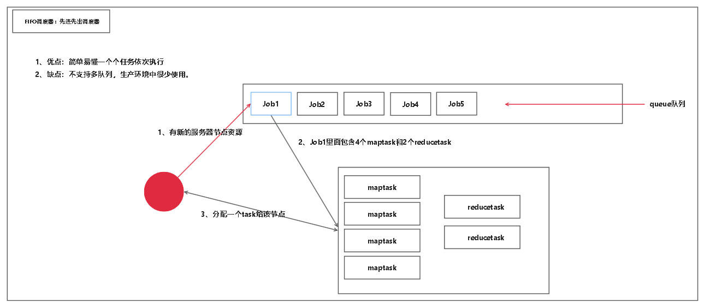
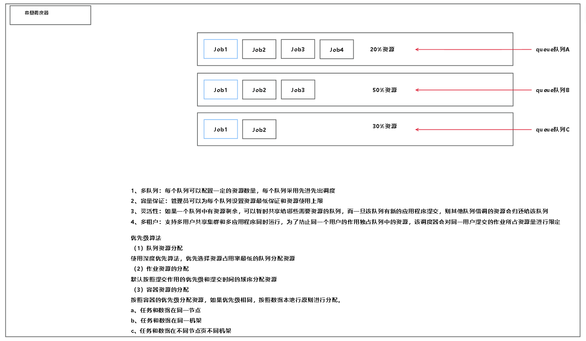
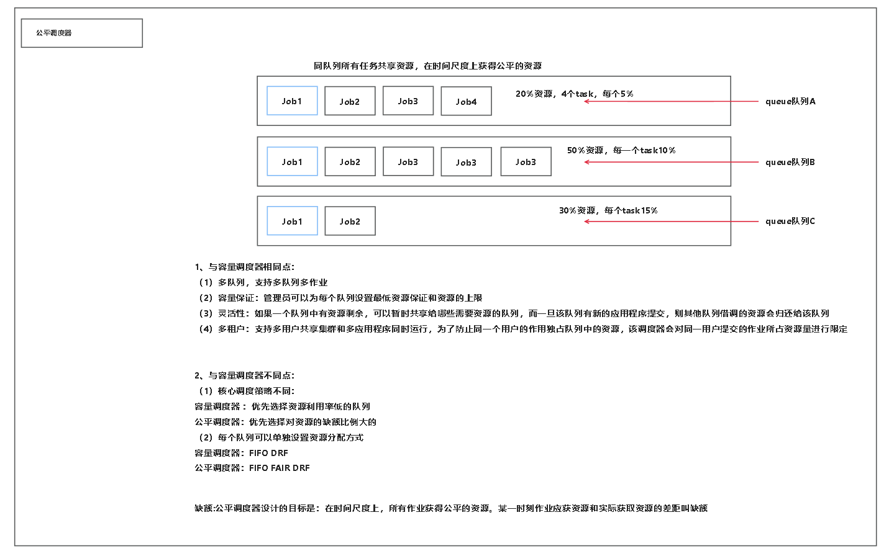

### 三种调度器
***(FIFO)先进先出调度器(默认模式)***
采用单队列的模式(先进先出)

优点:task一个一个的执行
缺点:不支持多队列,在生产环境中很少使用

***以下两者的相同点***
1、多队列:每个队列可以配置一定的资源数量,每个队列采用先进先出调度(多个队列)  

2、容量保证:管理员可以为每个队列设置资源最低保证和资源使用上限(从而保证了一定会有容量可以使用) 

3、灵活性:如果一个队列中有资源剩余,可以暂时共享给那些需要资源的队列,而一旦该队列有新的应用程序(task)提交,则其他队列借调的资源会归还给该队列。(资源的灵活性) 

4、多租户:支持多用户共享集群和多应用程序同时运行,为了防止同一用户的作业独占队列中的资源,该调度器会对同一用户提交的作业所独占资源量进行限定。
***容量调度器***

优先级算法
(1) 队列资源分配
使用深度优先算法,优先选择资源占用率最低的队列分配资源.

(2) 作业资源的分配
默认按照提交作业的优先度和提交作业的时间进行分配

(3) 容器资源的分配
按照容器的优先级进行分配资源,如果优先级相同，则按照数据本地化进行分配。
a.任务和数据在同一个节点
b.任务和数据在同一个机架
c.任务个数据在不同节点,不同机架

***公平调度器***
(1)核心调度策略不同
容量调度器:优先选择资源利用率低的队列
公平调度器:优先选择对资源的缺额比例大的

(2)
容量调度器:FIFO DRF
公平调度器:FIFO FAIR DRF

缺额：:某一时刻作业应获得资源和实际获取资源的差距叫做缺额。 
公平调度器设计的目标是:在时间尺度上,所有作业获得公平的资源

