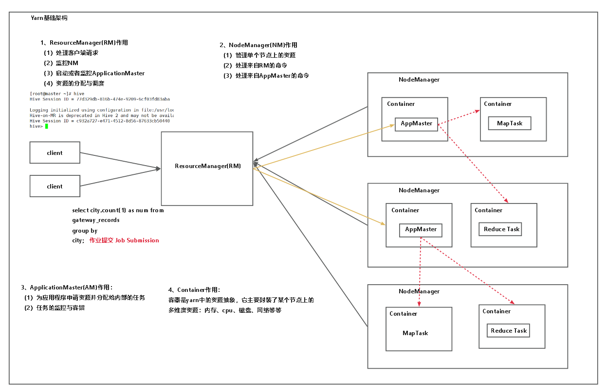

### 架构

客户端将作业(job)提交给yarn中的resource manager，
resource manager会分别随机在node manager上分配container和启动application master,
application master会分别随机在node manager上启动maptask和reducetask。
任务执行完成后，汇总nodemanager中reducetask的结果返回给resourcemanager.

### 各节点作用
***resourcemanager:***
启动application master并监控
监控node manager(其中有container资源和application master)
接受用户请求
资源分配和调度(整个yarn的资源分配和调度,分配container)

***nodemanager***

管理单个节点上的资源(也就是自己节点上的资源)
处理来自resourcemanager的命令
处理来applicationmaster的命令

***applicationmaster***+

为应用程序申请资源并分配给内部的任务
任务的监控与容错

***container***  

容器是yarn中的资源抽象,它主要封装了某个节点上的多维度资源:内存、cpu、磁盘、网络等等
