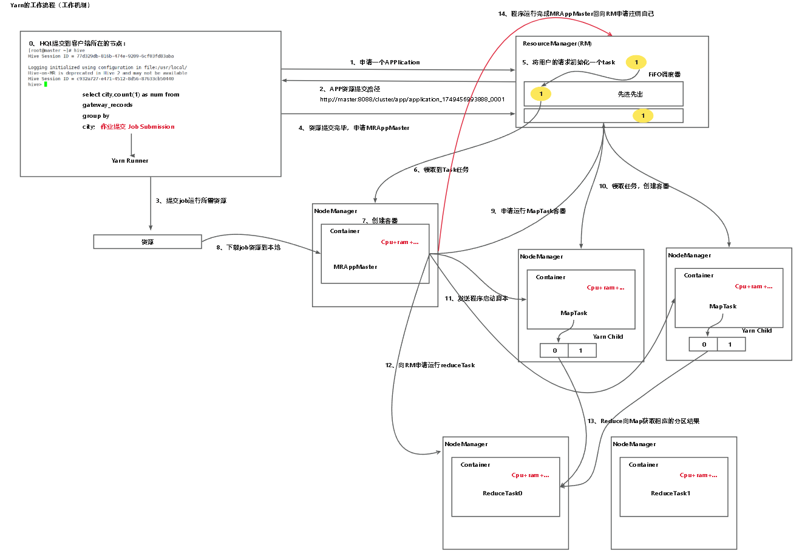

### 流程
首先作业在客户端里提交给YARN RUNNER，
然后客户端向resourcemanager申请application,resourcemanager返回application 资源提交路径给客户端,
客户端提交job所需要的资源给返回的资源路径，并且向resourcemanager返回已经将资源提交，并且申请mapreduce application master。
在接受到资源已经提交完毕后,resource manager将用户的请求初始化为一个task，并且根据内部的调度器(一般默认为FIFO) 将task发给nodemanager,nodemanager在接收到task后在内部创建容器(container),其中包含application master,并且将上传的资源下载到本地。
当准备完成后,nodemanager向resource manager申请运行maptask容器,并在其他的nodemanager中创建容器。随后application master向maptask发送启动脚本。在maptask运行后，随后向resource manager申请运行reducetask,reducetask拉取maptask的结果进行reduce，reduce完成后，mapreduce application master返回resource manager申请注销自己。

