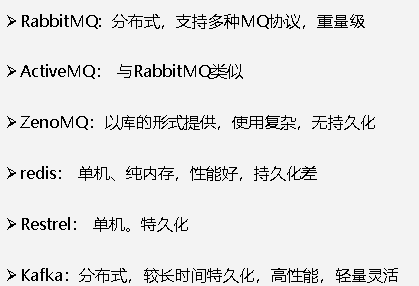
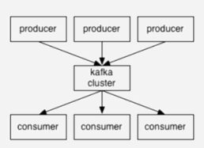
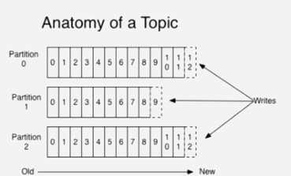

### Kafka的概念
Kafka是一个高吞吐的分布式消息系统
其中包括了 ***生产者***、***消息队列***、***消费者***

***使用Kafka的原因***

***Kafka性能好的原因***
1、Kafka写磁盘是顺序的，所以不断地往前产生,不断地向后写。

2、Kafka还用了sendFile的0拷贝技术,提高速度。

3、Kafka还用到了批量读写,一批批往里写，64K为单位。

### Kafka架构

producer:消息生产者

consumer:消息消费者

broker:Kafka集群的server 负责处理消息读、写请求，存储消息

topic:消息队列/分类
1、每个topic分成多个partition,每个partition内部消息强有序,其中的每个消息都有一个序号为offset。

2、每个partition只对应一个broker。但是一个broker可以管多个partition.

3、消息不经过内存缓冲,直接写入文件。根据时间策略(一般为7天)删除,而不是消费完就删除。

4、生产者可以自己决定往哪个partition写消息,可以是轮询的负载均衡,或者是基于hash的partition策略。(一般都使用轮询机制，因为hash分区可能会导致数据倾斜)

> consumer(消费者)
1、consumer自己维护消费到哪个offset.

2、每个consumer都有对应的group。且每个消息在一个group内只会被消费一次。

