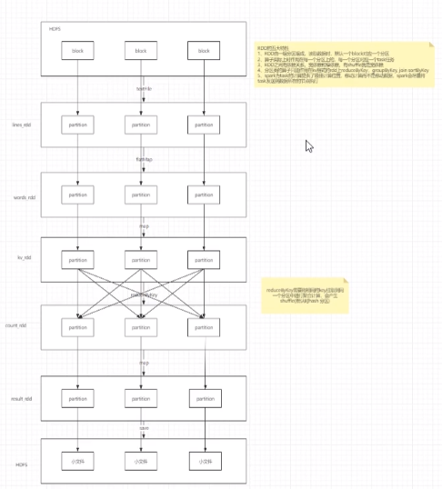

## RDD 五大特性
**1**、RDD由一组分区组成,读取数据时,默认一个block对应一个分区

**2** 、算子实际上作用在每一个分区上,每一个分区对应一个task

**3** 、RDD之间有依赖关系：宽依赖和窄依赖，有shuffle的是宽依赖,没有shuffle的是窄依赖

**4**、分区类的算子只能作用在kv格式的RDD上

**5**、spark为task的计算提供了最佳计算位置,移动计算而不是移动数据,spark会尽量将task的发送到数据所在节点执行
