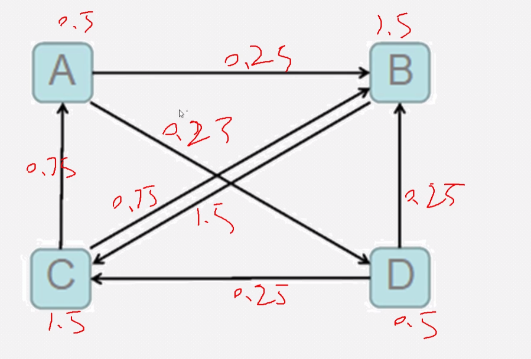

```python
"""
图存储
1、存顶点
A,B|D
B,C
C,A|B
D,B|C

2、存边
A-B
A-D
B-C
C-A
C-B
D-B
D-C

"""
from pyspark.context import SparkContext

sc = SparkContext(master="local[1]",appName="demo19_pagerank")

#1、读取数据
data_rdd = sc.textFile("../../data/pages.txt")

#2、整理数据
pages_rdd = data_rdd.map(lambda line:(line.split(",")[0],line.split(",")[1].split("|")))
# A,B|D --> ('A',['B','D'])

# 缓存
pages_rdd.cache()

# 计算网页的数量
N = pages_rdd.count()
# 阻尼系数
Q = 0.85

#3、给每个网页一个初始的PR值
init_pr_rdd = pages_rdd.map(lambda kv:(kv[0],kv[1],1.0))
# ('A',['B','D']) --> ('A',['B','D'],1.0)

while True:
    #4、将每个网页的pr平分给出链列表
    def avg_pr_fun(kv):
        linked = kv[1] # ['B','D']
        pr = kv[2] # 1.0

        # 计算每个网页均分给其他网页的pr值 即出链每条链值
        avg_pr = pr/len(linked) # 1.0/len(['B','D'])

        # 将pr值和网页关联
        linked_pr = [(p,avg_pr) for p in linked] #[(‘B’,0.5),('C',0.5)]

        return linked_pr

    avg_pr_rdd = init_pr_rdd.flatMap(avg_pr_fun)

    #5、计算新的pr值
    new_pr_rdd = avg_pr_rdd.reduceByKey(lambda x,y :x+y)

    # 增加阻尼系数
    new_pr_rdd = new_pr_rdd.map(lambda kv:(kv[0],(1-Q)/N + Q * kv[1]))#阻尼系数公式

    #6、关联获取出链列表
    join_rdd =new_pr_rdd.join(pages_rdd,numPartitions=1)
    # 如果这里不设置为1的话,分区会越来越多,因为new_pr_rdd的分区会随着循环越来越多
    # ('A',(['B','D'],0.5))

    #7、整理格式
    new_pr_linked_rdd = join_rdd.map(lambda kv: (kv[0],kv[1][1],kv[1][0]))
    # ('A',['B','D'],0.5)

    #计算pr值和前一次pr的差值平均值
    new_pr_init_pr_rdd = new_pr_rdd.join(init_pr_rdd.map(lambda kv:(kv[0],kv[2])))
    #init_pr_rdd为前一次的值
    #new_pr_rdd为本次的值

    # 计算差值
    diff_pr = new_pr_init_pr_rdd.map(lambda kv:abs(kv[1][0] - kv[1][1])).sum()

    #计算平均值
    avg_diff_pr = diff_pr / N
    print(f"差值平均值:{avg_diff_pr}")
    if avg_diff_pr < 0.01:
        # 保存结果
        new_pr_linked_rdd.saveAsTextFile("../../data/pagerank")
        break

    # 切换新的pr值进行下一次计算
    init_pr_rdd = new_pr_linked_rdd
    print("=" * 100)
```
连接图如下：

