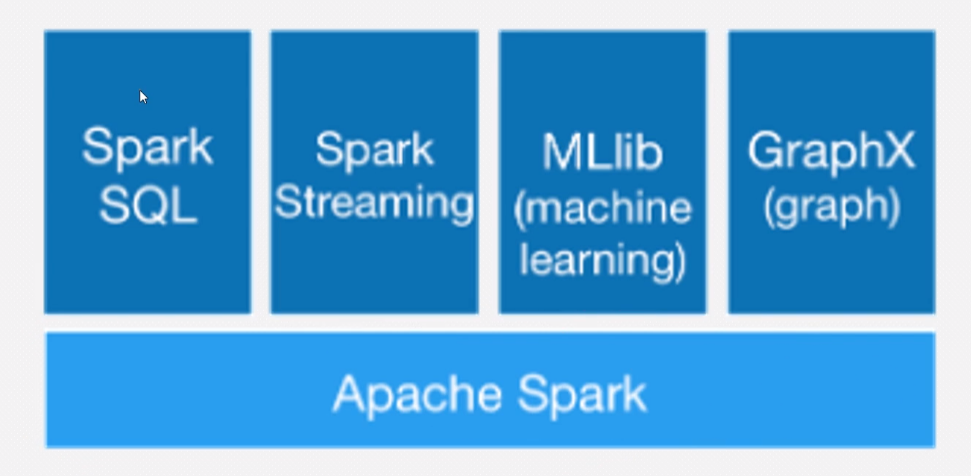
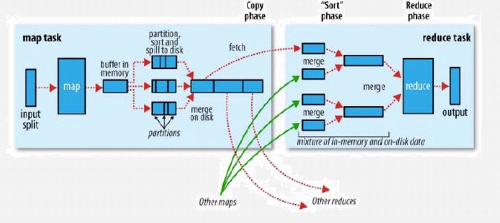

## spark 是什么？
spark 是一个可以用来做数据科学、机器学习的开源分布式多语言引擎

## spark 框架
ps:*为重点，其他了解即可
*spark core:spark的核心,使用RDD进行编程
*spark sql:封装了spark core，可以写sql语言
spark streaming:封装了spark core,对数据进行微批处理
mLlib:封装了spark core,进行模型训练等机器学习相关工作
graphx:封装了spark core，进行图片相关的计算

## spark 内部计算逻辑
spark内部逻辑与mapreduce几乎同，都有map shuffle reduce  

不过在多个mapreduce时：
**spark**会将上一个mapreduce的reduce阶段作为下一个mapreduce的map阶段。
而**mapreduce**则是将上一个mapreduce的reduce结果作为下一个mapreduce的map的输入。

## spark运行模式
**local**:本地测试
**standalone**
**mesos**:
**yarn**:
**K8S**