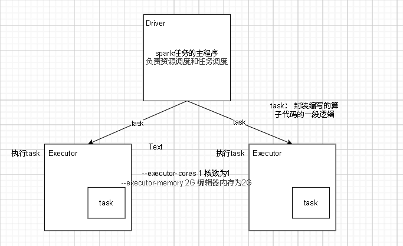
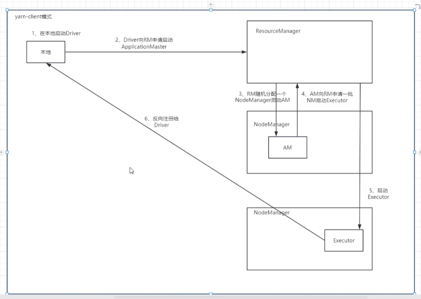
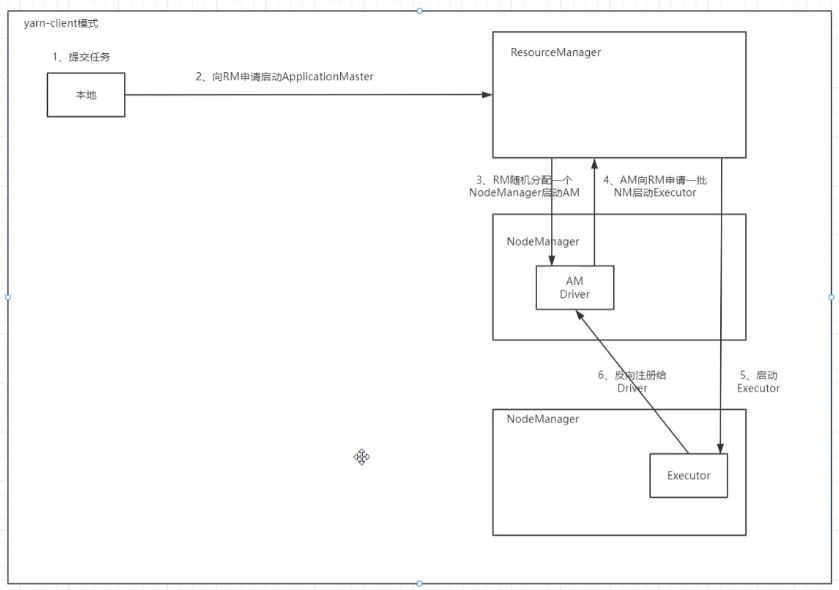

### ***任务调度和资源调度***

*资源调度*:申请资源 (state: ACCEPTED)

*任务调度*:执行task (state: RUNNING)

### ***spark和mapreduce在资源调度的区别***

**spark**:粗粒度
         将全部先申请下来，然后执行task,当所有的task执行完再释放资源
         优点: task启动快，任务执行快
         缺点: 可能会浪费资源
         --num-executors 1 执行器(executors) 为1
         --executor-cores 1 每个执行器(executors)的核为1
         --executor-memory 2G 每个执行器(executors)的内存为2G 

**mapreduce**:细粒度
         每个task自己申请资源，自己执行，自己释放
         优点: 充分利用资源
         缺点: task 启动慢,任务执行慢
         
**spark-sql开启时，资源会被一直占用,直到spark-sql被关闭才会释放**

### ***yarn client模式和yarn cluster模式的区别***
1、client模式的Driver在本地(提交任务的节点)启动，在本地可以看到详细的日志,**此时driver程序名为spark submit** 

2、cluster模式的Driver在随机一台NodeManager上,本地不能看详细的执行日志(因为日志不在本地)，**此时driver程序名为 Application master**(既做driver也做Application master)，此时submit为监控程序  

3、cluster模式,执行失败会自动重试一次  

4、如果大量的任务都是用cilent模式提交,那么或导致本地节点网卡流量剧增(因为cilent只有一个Driver,过多任务的注册会增加压力)  

5、client模式一般用于测试，而cluster模式一般用于任务上调度。

