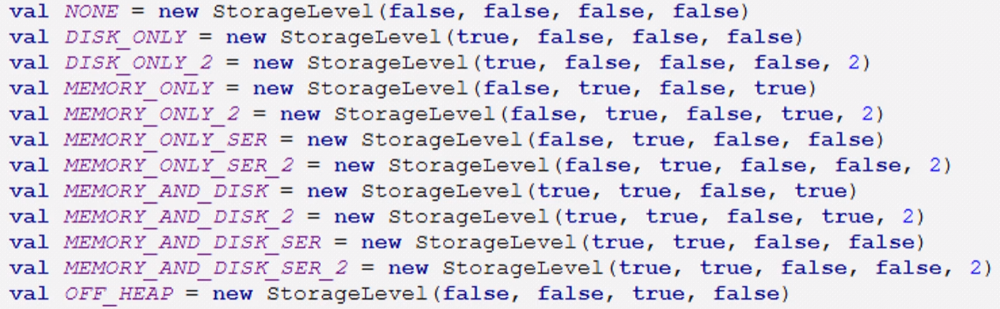

## ***缓存***
### ***使用原因***
存储多次被调用的RDD，在多次调用时不会使task多次从头读取计算该RDD，从而提升速度。

### ***原理***
当job第一次执行,遇到cache()/persist()函数时会将RDD存入内存/磁盘中，当以后读取的时候就直接使用该RDD,不会再执行前面的流程

### ***函数***
**cache() 函数**
```python
 def cache(self):
        """
        Persist this RDD with the default storage level (`MEMORY_ONLY`).
        """
        self.is_cached = True
        self.persist(StorageLevel.MEMORY_ONLY)
        return self
```
这里默认为**MEMORY_ONLY**,即存储在内存

所以使用时可以使用**persist(StorageLevel.内存存储方式)函数**来指定内存存储方式

### ***内存存储方式***


useDisk:是否使用内存
useMemory:是否使用内存
useOffHeap:是否使用堆内存，使用堆外内存是，为堆内内存的0.1
**堆内存**
这里指JVM(即java虚拟机)中的内存
deserialized:是否反序列,**python因为要和java通信,自动为False,即全部序列化(转为二进制等形式，方便保存和传输)**
replication:副本数


DISK_ONLY:只放在磁盘 **(基本没区别,因为读取数据本来就是从磁盘里面读)**
DISK_ONLY_2:只放在磁盘且副本数为2
MEMROY_ONLY:只放在内存 **(数据量小优先,内存速度快)**
MEMROY_AND_DISK:优先放在内存，内存不够则溢写到磁盘 **(数据量大)**
MEMROY_AND_DISK_SER:将数据序列化并且优先放在内存，内存不够则溢写到磁盘 **(数据量大优先,尽最大程度放在内存里面来提升速度)**
OFF_HEAP:是否使用堆内存

```python
from pyspark.context import SparkContext
from pyspark.storagelevel import StorageLevel

sc = SparkContext(master="local",appName="demo18")

student_rdd = sc.textFile("../../data/students.txt")

def map_fun(stu):
    print(f"map_fun；{stu}")
    return stu.split(",")[-1]

class_rdd = student_rdd.map(map_fun)
# class_rdd.cache()

class_rdd.persist(StorageLevel.MEMORY_AND_DISK)

class_rdd.foreach(print)

class_rdd.foreach(print)
class_rdd.saveAsTextFile("../../data/clazz")
```
